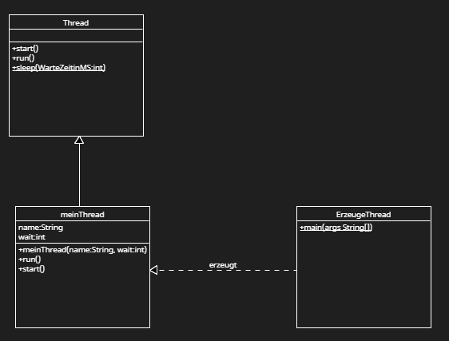

Thread erzeugen

Aufgaben 
1. Erzeugen Sie die Java Dateien 
    - ErzeugeThreads.java
    - meinThread.java

2. Fügen Sie eine main-Methode in die Klasse "ErzeugeThreads" ein 

3. Die Klasse MeinThreads soll von der Klasse Thread erben.

4. Jeder Thread hat einen Namen und eine Wartezeit in ms und zählt von 1 bis 100. Der Thread gibt diese Werte nachdem er gestartet wurde nebeläufig  auf die Konsole aus.
    Erweitern Sie die Thread Klasse und testen Sie 2 Threads mit 30 und 100ms Wartezeit.

5. Beim erzeugung des Threads soll die Wartezeit und der Name festgelegt sein. -> Konstruktor mit Übergabeparameter

6. Zeigen Sie das der Main-Thread vor dem zählthread zuende ist obwohl dieser zeuerst gestartet wird.

7. Erzeugen Sie ein Klassendiagramm

